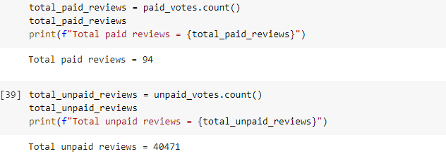
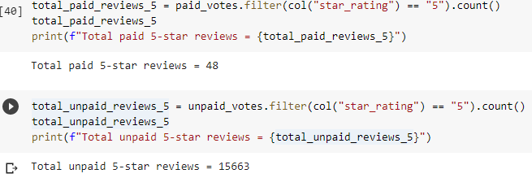
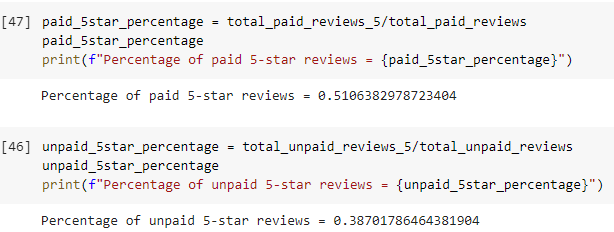

# Amazon_Vine_Analysis
## Purpose
The purpose of this study is to determine the level of bias in Amazon product reviews. The dataset used for this analysis inclused reviews for US video games. The total paid and unpaid reviews, as well as the number of 5-start reviews were extracted from the data set.

Total Paid and Unpaid Reviews

Total Paid and Unpaid 5-star Reviews.

Percentage of Paid and Unpaid Reviews.

## Summary

The percentage of paid and unpaid 5-star reviews in the Vine program show that 51% of paid reviewers gave 5 stars to the products while 39% of the total unpaid reviewers gave 5-stars. This may indicate that paid reviewers may be more inclined to give 5-star ratins. However, the total number of viewers on each side is vastly different.  There were only 94 paid ratings versus 40474 unpaid ratings. 
Further analysis can be done to determine whether the paid ratings have any influence on the unpaid ones. A statistical analysis may determine whether more products are purchased after a customer reads positive reviews.

